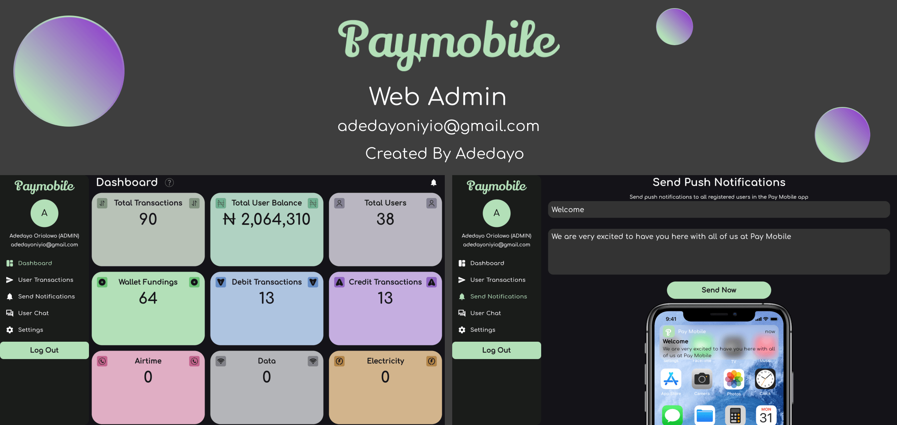
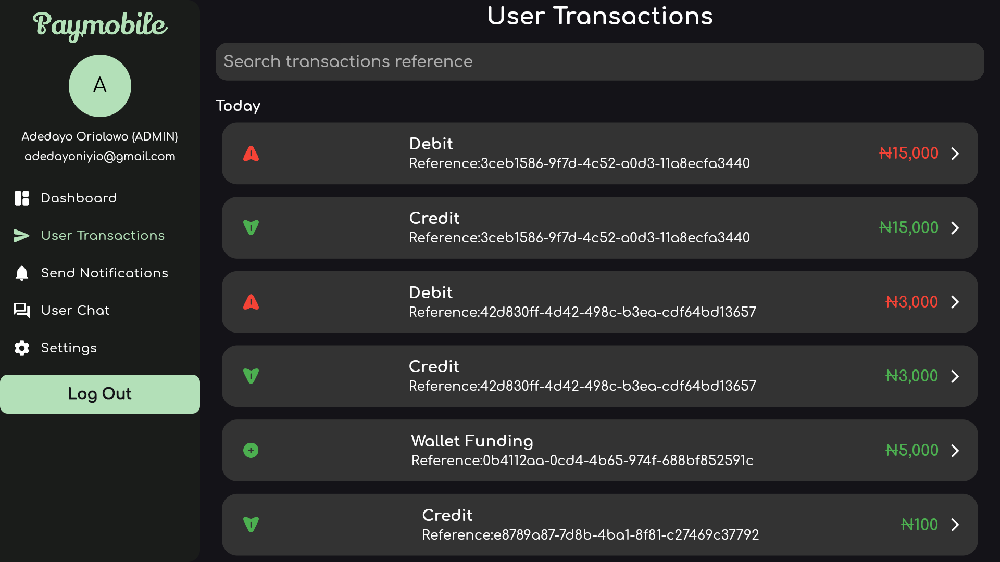
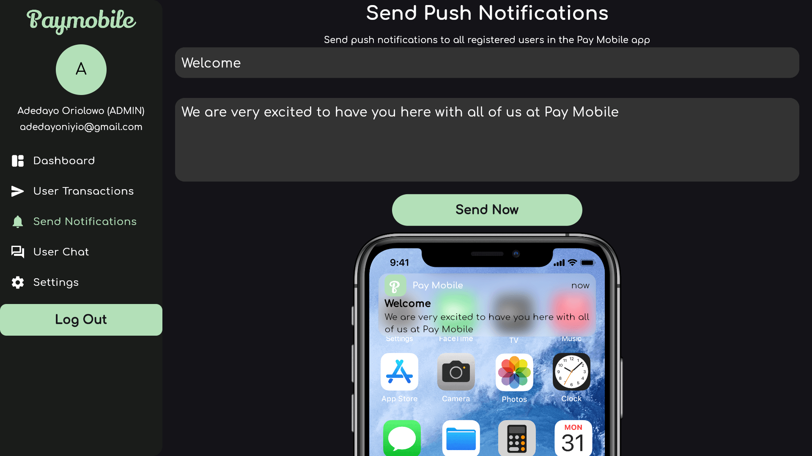

# Pay Mobile Web Admin




## This is the Web Admin for the Pay Mobile app. It has two levels (i.e ADMIN and AGENT). Agent has limited features but ADMIN has all the features

# Main Features

#### 1. Dashboard for viewing all user


##### 2. View All User Transactions. Search by Reference and perform Actions



##### 3. Send Push Notification to all Registered Users



##### 4. In-app customer service support


#### 1. Sign Up Verification


#### 2. Forgort Password


### QUICK START ⚡

### Note: The server running this web app has already been deployed to render.com, which means you can immediately clone this repo, run it and start using it (i.e The backend is already connected).

### Some Features have been removed from AGENT accounts


#### After cloning don't forget to run:

```bash
flutter pub get
```

## Packages Used 📦

1. <a href="https://pub.dev/packages?q=provider">provider</a>
2. <a href="https://pub.dev/packages/shared_preferences">shared_preferences</a>
3. <a href="https://pub.dev/packages/http">http</a>
4. <a href="https://pub.dev/packages/intl">intl</a>
5. <a href="https://pub.dev/packages/internet_connection_checker">internet_connrction_checker</a>

6. <a href="https://pub.dev/packages/flutter_native_splash">flutter_native_splash</a>
7. <a href="https://pub.dev/packages/firebase_core">firebase_core</a>
8. <a href="https://pub.dev/packages/firebase_messaging">firebase_messaging</a>
9. <a href="https://pub.dev/packages/cloud_firestore">cloud_firestore</a>
10. <a href="https://pub.dev/packages/socket_io_client">socket_io_client</a>
11. <a href="https://pub.dev/packages/awesome_notifications">awesome_notifications</a>

#### Here are some test login details of ADMINs

```json
{
"username":"lere",
"pin":"7171",
"password":"test123",
}
{
"username":"johndoe",
"pin":"7171",
"password":"test123",
}
{
"username":"alice",
"pin":"7070",
"password":"test123",
}
{
"username":"bob",
"pin":"7474",
"password":"test123",
}
```

### If you choose to run it on your own server, visit the Pay Mobile Server Repo

## This is the official Nodejs server code that this app is running on <a href="https://github.com/adedayoniyi/Pay-Mobile-Server">Pay Mobile Server</a>

## Important

### After you are done with configuring the server, dont forget to update the uri in the global_constants.dart file

1. Locate lib\core\utils\global_constants.dart and edit line 6 using the server URL you generated or created. Changes will apply globally. Check Below:

```dart
6. const String uri = "https://transfer-dayo-niyi.onrender.com";
```

To

```dart
6. const String uri = "Your server URL";
```

## That's All 🎉🎉🎉

## Contributing

Pull requests are welcome. If you encounter any problem with the app or server, you can open an issue.

##### If you liked this project, don't forget to leave a star 🌟.

##### Note: As of now, no tests are available

## License

This project is licensed under the MIT License - see the <a href="https://github.com/adedayoniyi/Pay-Mobile-P2P-Money-Transfer-App/blob/main/LICENSE.md">LICENSE</a> file for details.
