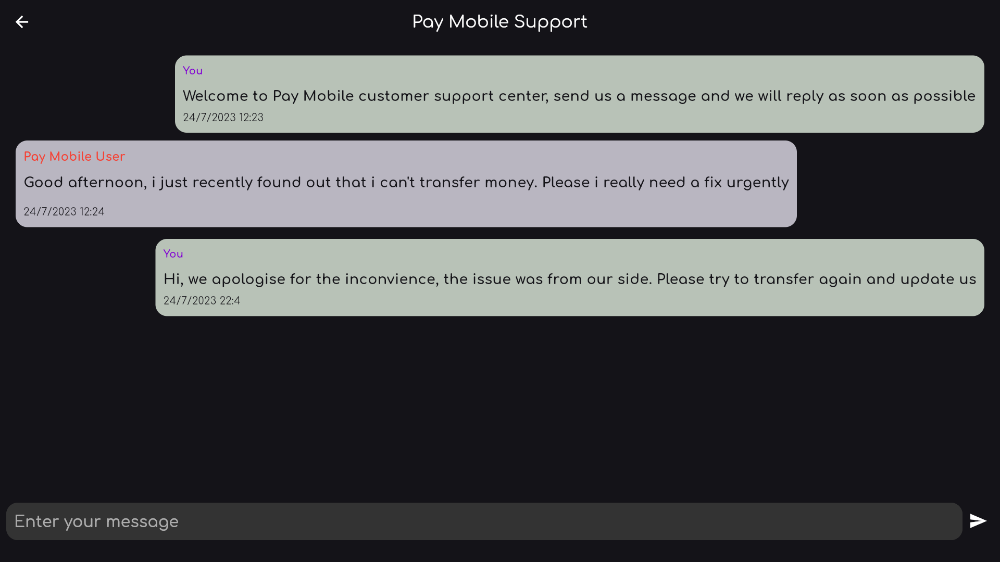
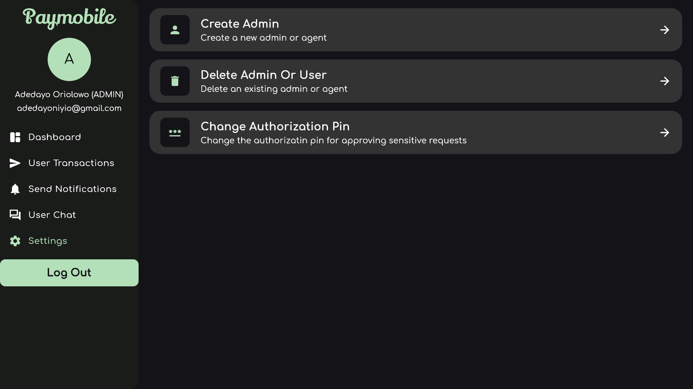
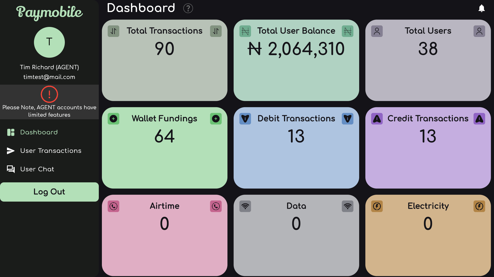
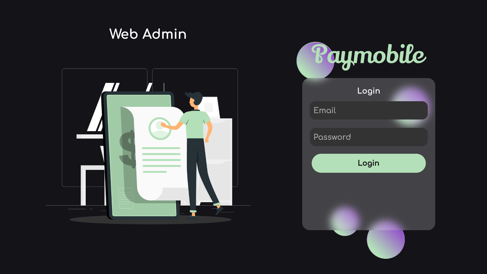

# Pay Mobile Web Admin


## This is the Web Admin for the <a href="https://github.com/adedayoniyi/Pay-Mobile-P2P-Money-Transfer-App">Pay Mobile P2P Money Transfer App</a>. It has two levels `(i.e ADMIN and AGENT)` . `AGENT(Customer Service)` has limited features but `ADMIN` has all the features.

#### Live Link: <a href="https://pay-mobile.netlify.app/">Pay Mobile Web Admin</a>

# Main Features

#### 1. Dashboard for viewing all users neccessary data.


#### 2. View All User Transactions. Search by Reference and perform Actions


#### 3. Send Push Notification to all Registered Users. Only `ADMINS` can use this feature.


#### 4. In-app customer service support. `ADMIN` can reply to all messages but `AGENTS` can only reply to messages from users selected at random



#### 5. Settings, only `ADMIN` can access this route



### Note: Some Features have been removed from AGENT accounts



### After log in, the user type state is stored and used throughout the web app



### QUICK START ⚡

#### Visit:<a href=" https://github.com/adedayoniyi/Pay-Mobile-Full-Stack"> Pay Mobile Full Stack </a> to access the full stack code of the software (i.e the Back End and the Mobile Front End)

### Note: The server running this web app has already been deployed to render.com, which means you can immediately clone this repo, run it and start using it (i.e The backend is already connected).

#### After cloning don't forget to run:

```bash
flutter pub get
```

## Packages Used 📦

1. <a href="https://pub.dev/packages?q=provider">provider</a>
2. <a href="https://pub.dev/packages/shared_preferences">shared_preferences</a>
3. <a href="https://pub.dev/packages/http">http</a>
4. <a href="https://pub.dev/packages/intl">intl</a>

5. <a href="https://pub.dev/packages/socket_io_client">socket_io_client</a>
6. <a href="https://pub.dev/packages/responsive_framework">responsive_framework</a>

#### Here are some test login details of `ADMINs`

```json
{
"email":"evanmusktest@mail.com",
"password":"test123",
}
{
"email":"rhodesmail@mail.com",
"password":"test123",
}
```

#### Here are some test login details of `AGENTS`

```json
{
"email":"timtest@mail.com",
"password":"test123",
}
{
"email":"welchtest@mail.com",
"password":"test123",
}
{
"email":"amostestemail@mail.com",
"password":"test123",
}
```

### If you choose to run it on your own server, visit the Pay Mobile Server Repo

## This is the official Nodejs server code that this Web app is running on <a href="https://github.com/adedayoniyi/Pay-Mobile-Server">Pay Mobile Server</a>

## Important

### After you are done with configuring the server, don't forget to update the uri in the global_constants.dart file

1. Locate lib\core\utils\global_constants.dart and edit line 6 using the server URL you generated or created. Changes will apply globally. Check Below:

```dart
6. const String uri = "https://transfer-dayo-niyi.onrender.com";
```

To

```dart
6. const String uri = "Your server URL";
```

## That's All 🎉🎉🎉

## Contributing

Pull requests are welcome. If you encounter any problem with the app or server, you can open an issue.

##### If you liked this project, don't forget to leave a star 🌟.

##### Note: As of now, no tests are available

## License

This project is licensed under the MIT License - see the <a href="https://github.com/adedayoniyi/Pay-Mobile-P2P-Money-Transfer-App/blob/main/LICENSE.md">LICENSE</a> file for details.
